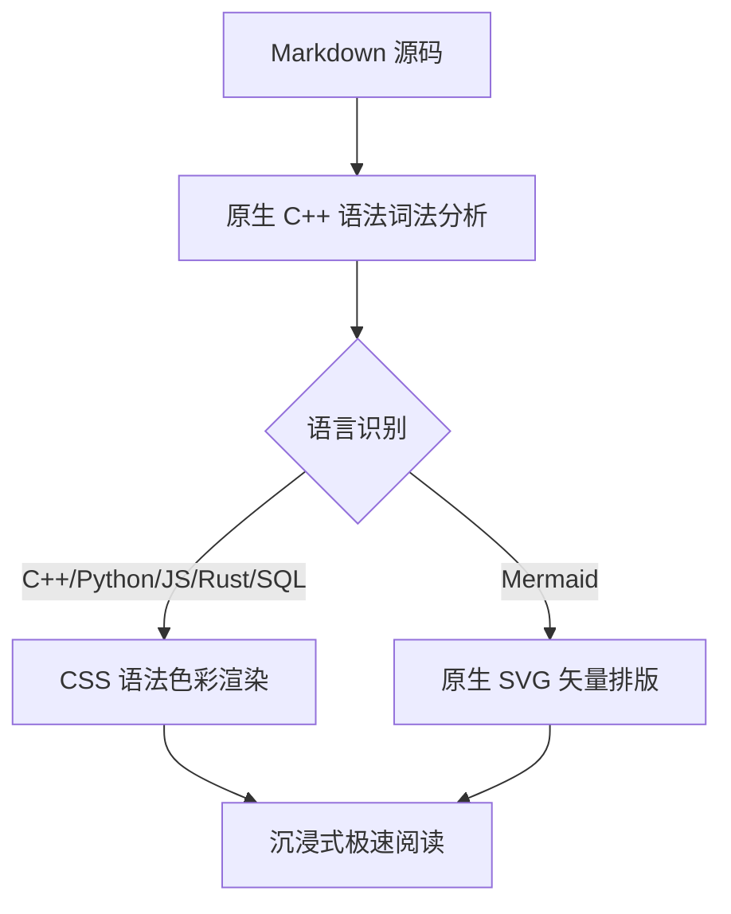

# FlashRead 代码高亮与图表渲染演示

这是一份全面的 Markdown 代码语法高亮与原生矢量图表示例文档。

---

## 1. C++ (Modern C++20)

```cpp
#include <iostream>
#include <vector>
#include <string>
#include <memory>

// 定义一个文档控制器
class DocumentController final {
public:
    explicit DocumentController(std::string title)
        : m_title(std::move(title)) {}

    [[nodiscard]] std::string title() const { return m_title; }
    void render() const {
        std::cout << "[Render] " << m_title << " rendered successfully!\n";
    }

private:
    std::string m_title;
};

int main(int argc, char *argv[]) {
    auto doc = std::make_unique<DocumentController>("FlashRead C++20");
    doc->render();
    return 0;
}
```

---

## 2. Python

```python
import sys
from dataclasses import dataclass
from typing import List, Optional

@dataclass
class CodeSnippet:
    language: str
    code: str
    line_count: int = 0

    def format_badge(self) -> str:
        """返回语言角标"""
        return f"[{self.language.upper()}] ({self.line_count} lines)"

def process_snippets(snippets: List[CodeSnippet]) -> Optional[str]:
    for snippet in snippets:
        if snippet.language == "python":
            print(f"Highlighted: {snippet.format_badge()}")
    return "Done"
```

---

## 3. TypeScript / JavaScript

```typescript
interface ThemeConfig {
    id: string;
    accent: string;
    isDark: boolean;
}

export async function loadDocument(path: string): Promise<ThemeConfig> {
    const response = await fetch(`/api/docs?path=${encodeURIComponent(path)}`);
    const data = await response.json();
    console.log("Document loaded:", data);
    return {
        id: "github-dark",
        accent: "#79b68f",
        isDark: true
    };
}
```

---

## 4. Rust

```rust
use std::collections::HashMap;

pub struct SyntaxEngine {
    languages: HashMap<String, String>,
}

impl SyntaxEngine {
    pub fn new() -> Self {
        let mut languages = HashMap::new();
        languages.insert(String::from("rs"), String::from("Rust"));
        SyntaxEngine { languages }
    }

    pub fn highlight(&self, code: &str) -> Result<usize, &'static str> {
        if code.is_empty() {
            Err("Code cannot be empty")
        } else {
            Ok(code.len())
        }
    }
}
```

---

## 5. SQL

```sql
SELECT 
    u.id, 
    u.username, 
    COUNT(d.id) AS document_count
FROM users u
LEFT JOIN documents d ON u.id = d.user_id
WHERE u.status = 'active'
GROUP BY u.id, u.username
HAVING COUNT(d.id) > 5
ORDER BY document_count DESC
LIMIT 10;
```

---

## 6. JSON & YAML

```json
{
  "name": "FlashRead",
  "version": "1.0.0",
  "native": true,
  "theme": "github-dark",
  "features": ["diagrams", "syntax-highlighting", "async-loading"],
  "stats": {
    "fps": 60,
    "memory_mb": 45
  }
}
```

```yaml
version: '3.8'
services:
  flashread:
    image: flashread:latest
    environment:
      - THEME=vscode-dark
      - PERFORMANCE_MODE=high
    restart: always
```

---

## 7. Git Diff

```diff
diff --git a/src/MarkdownRenderer.cpp b/src/MarkdownRenderer.cpp
--- a/src/MarkdownRenderer.cpp
+++ b/src/MarkdownRenderer.cpp
@@ -10,6 +10,8 @@
- // Monochrome pre block
+ QString highlightedHtml = Syntax::SyntaxHighlighter::highlightToHtml(rawCode, lang);
```

---

## 8. 原生 Mermaid 流程图


