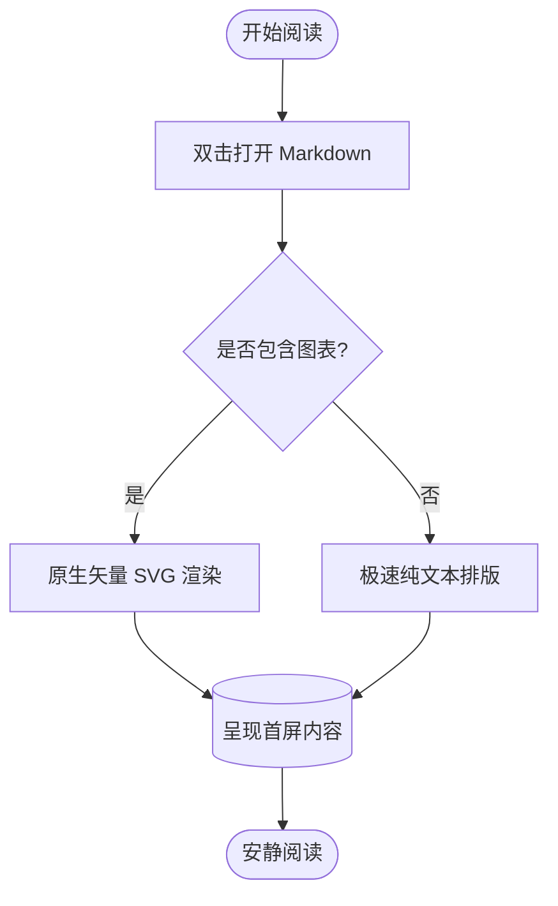
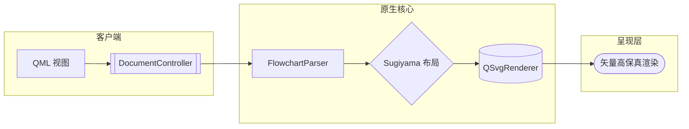
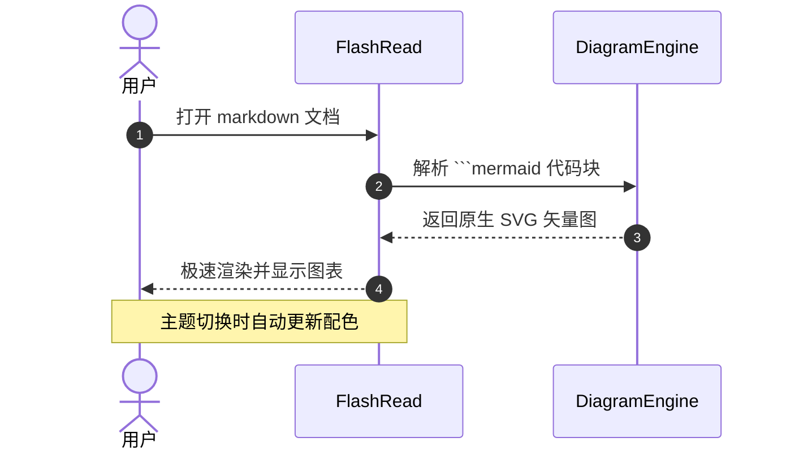

# FlashRead 流程图与图表测试

本文档用于测试 FlashRead 原生 Markdown 查看器对 **Mermaid 流程图与时序图** 的极速原生渲染支持。

## 1. 基础业务流程图 (Flowchart TD)



## 2. 横向架构与多形状节点 (Flowchart LR)



## 3. 交互时序图 (Sequence Diagram)



## 4. 常规文本与代码块混合

```cpp
constexpr auto goal = "show content first, fast and quiet";
```

- 测试列表项目 1
- 测试列表项目 2
- **加粗文本** 与 *斜体文本*
